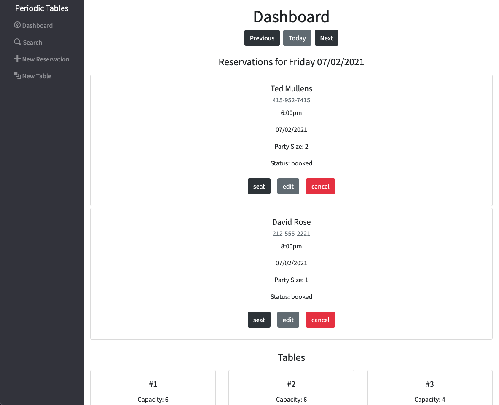
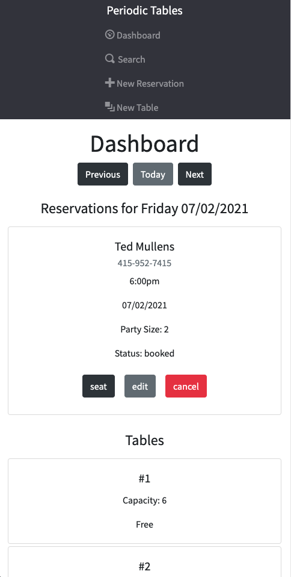
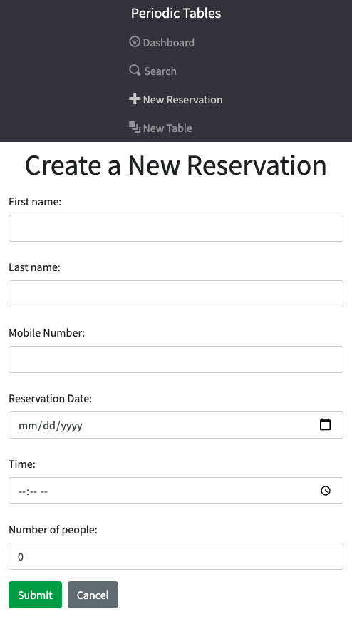
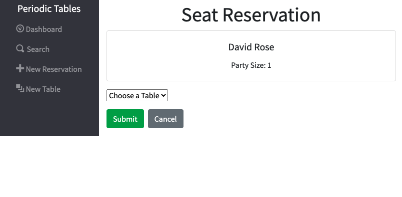

# Capstone: Restaurant Reservation System

## Project Description

> Fullstack application that allows users to create, view, update, search, and cancel reservations as well as create new tables.
> The software is used only by restaurant personnel when a customer calls to request a reservation.

## Built With
- React
- CSS
- Bootstrap
- JavaScript
- Node.js
- Express
- Postgres
- Knex
- CORS

## API Documentation

| API path                               | Function                                                                                                        |
| -------------------------------------- | --------------------------------------------------------------------------------------------------------------- |
| `/reservations`                        | GET: List all reservations by date ordered by reservation_time POST: Create a new reservation                   |
| `/reservations/:reservation_id`        | GET: A reservation by reservation_id PUT: Update a reservation by reservation_id                                |
| `/reservations/:reservation_id/status` | PUT: Update a reservation status to "booked", "seated", "finished", or "cancelled"                              |
| `/tables`                              | GET: List all tables POST: Create a new table                                                                   |
| `/tables:table_id/seat`                | PUT: Update a table's status to "Occupied" DELETE: Update a table's status to "Free"                            |

## Screenshots

- The dashboard displays all reservations for a given date as well as all tables and their status.

- The `reservations/new` page displays a form with reservation information fields. Clicking `Submit` creates the reservation and displays the dashboard for that reservation's date.

- The `reservations/:reservation_id/edit` page displays a form prepopulated with the information associated with the given `reservation_id`. Changing any information then clicking `Submit` updates the reservation and displays the dashboard for that reservation's date.

- The `reservations/:reservation_id/seat` page displays a drop-down select to choose which table to seat the reservation at. Only tables that are unoccupied and have a capacity large enough to fit the reservation are offered as options.

- The `/search` page displays a search box to search reservations by telephone number. Entering a phone number and clicking `Search` displays all reservations associated with that phone number, ordered by reservation date. If no reservations match the given phone number `No Reservations Found` is displayed.

## Installation

1. Fork and clone this repository.
1. Run `cp ./back-end/.env.sample ./back-end/.env`.
1. Update the `./back-end/.env` file with the connection URL's to your ElephantSQL database instance.
1. Run `cp ./front-end/.env.sample ./front-end/.env`.
1. You should not need to make changes to the `./front-end/.env` file unless you want to connect to a backend at a location other than `http://localhost:5000`.
1. Run `npm install` to install project dependencies.
1. Run `npm run start:dev` to start your server in development mode.
